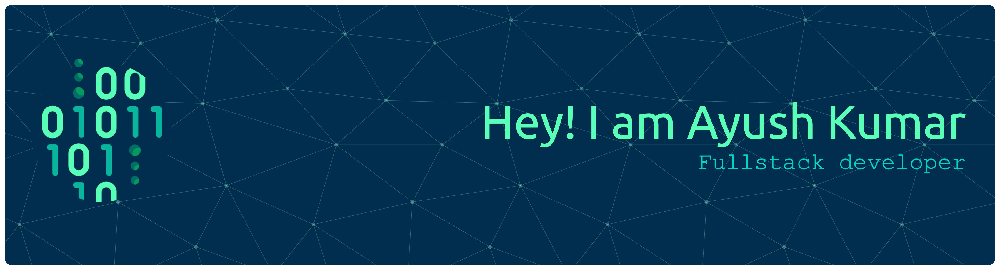

<h1 align="center">Hi 👋, I'm Ayush Kumar</h1>

<!--Night Owl image-->

  

<!--Start Intro-->               

I am a Full Stack Developer and Machine Learning Enthusiast with a huge love for Python, React.js, Node.js, Django, RDBMS, REST API and Data Visualization. 

- ✨ Student of life :)
- 🌱 I’m currently learning many things, I believe that everyday is a learning opportunity.
- 🎓 Pursuing a Bachelor's in Computer Science
- 🧠 Consistently grinding Striver Sheet to master DSA—no zero days!
- ⚙️ Learning DevOps alongside full-stack development to become job-ready for 20+ LPA roles
- 🧪 Exploring LangChain, LLMs, and integrating AI into real-world apps
- 🎧 Watching Sports + music = the ultimate coding vibe

 

<!--Languages and Tools Section-->       
<h2 align="center">Tᴇᴄʜ sᴛᴀᴄᴋ & Lᴀᴛᴇsᴛ ʙʟᴏɢs</h2> 
<picture>
  <source media="(prefers-color-scheme: dark)" srcset="./Skills_Animation_Dark.gif">
  <source media="(prefers-color-scheme: light)" srcset="./Skills_Animation_White.gif">
  
</picture>
 
 
 

<h3 align="left">Current Learning</h3>
<ul align="left">
  <li>Deepening my knowledge in Machine Learning and AI.</li>
  <li>Exploring advanced React.js patterns and state management techniques.</li>
  <li>Improving my skills in cloud computing with AWS and Azure.</li>
  <li>Built tools like meeting auto-joiners with WhatsApp alerts, and working on projects with AI-powered features</li> 
</ul>
 

<h3 align="left">Connect with me:</h3>

 

# 📊 GitHub Stats:

 

# 📊 LeetCode Stats:

<!-- 

 -->

